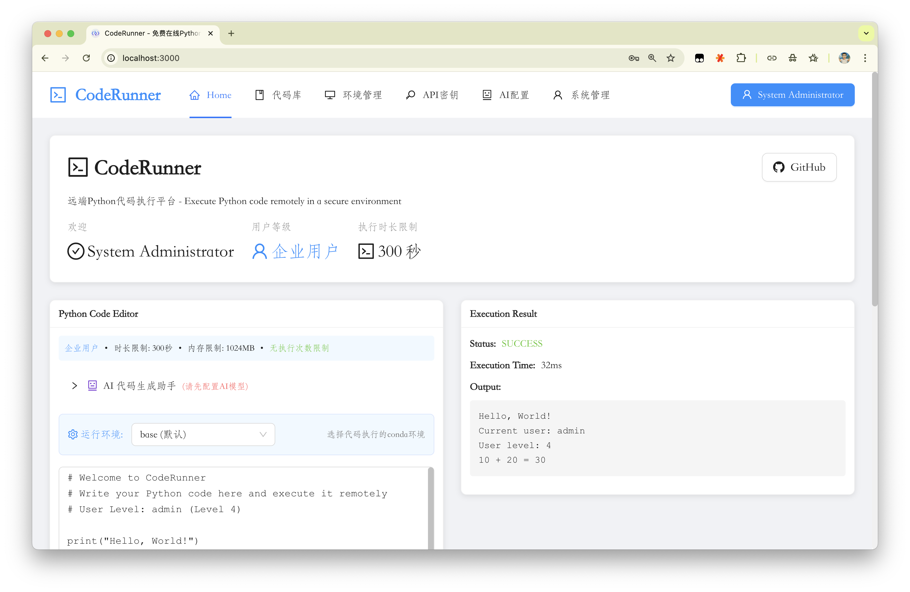

# CodeRunner - 远程Python代码执行平台

[](LICENSE)
[](docker)
[](https://www.python.org/)
[](https://fastapi.tiangolo.com/)
[](https://reactjs.org/)

CodeRunner是一个基于FastAPI（后端）和React + Ant Design（前端）构建的远程Python代码执行平台。它提供了用户认证、多层级用户权限、AI代码生成、安全的Python代码执行、代码库管理、API密钥管理、环境管理、社区互动功能以及全面的系统日志记录。

## 🖼️ 应用预览

### 在线演示
- **演示地址**: [https://code.qfpqhyl.cloudns.org/](https://code.qfpqhyl.cloudns.org/)
- **默认账号**: admin / admin123 (请在登录后修改密码)

### 应用界面截图



**界面特色功能**:
- 🎨 现代化中文界面，基于Ant Design设计语言
- 💻 实时代码编辑器，支持语法高亮和自动补全
- 📊 用户仪表板，显示执行统计和配额使用情况
- 🤖 AI代码生成助手，支持多种AI模型
- 📚 个人代码库管理，支持标签和分类
- 🔧 环境管理，支持多conda环境隔离
- 📈 系统管理面板，全面的用户和日志管理
- 🧑‍🤝‍🧑 社区互动：帖子、评论、点赞、收藏、关注

## ✨ 主要特性

### 🔐 用户系统
- JWT令牌认证，30分钟过期
- Argon2密码哈希加密
- 管理员/用户角色分离
- 多层级用户权限系统

### 👥 用户等级系统
- **Level 1 (免费)**: 10次/日执行，20次/日API调用，30s超时，128MB内存，5个保存代码，2个API密钥
- **Level 2 (基础)**: 50次/日执行，100次/日API调用，60s超时，256MB内存，20个保存代码，5个API密钥
- **Level 3 (高级)**: 200次/日执行，500次/日API调用，120s超时，512MB内存，100个保存代码，10个API密钥
- **Level 4 (企业)**: 无限执行，无限API调用，300s超时，1024MB内存，无限保存代码和API密钥

### 🚀 代码执行
- 安全的临时文件执行，自动清理
- 基于用户级别的超时和资源限制
- 每日执行配额和API调用配额
- 执行历史记录和内存使用跟踪
- 所有操作的系统日志记录，包含IP跟踪

### 🤖 AI集成
- 多AI提供商支持（Qwen、OpenAI、Claude、自定义OpenAI兼容API）
- 用户可配置的AI模型和API密钥管理
- 可自定义参数的代码生成（temperature、max_tokens）
- 活跃AI配置管理

### 📚 代码库
- 个人代码片段存储和标签管理
- 公开/私有代码分享
- API访问保存的代码以供外部执行
- 搜索和组织功能

### 🔧 系统管理
- 全面的系统日志过滤
- 管理员用户管理
- 执行监控和统计
- API密钥使用跟踪

## 🛠️ 技术栈

### 后端技术
- **FastAPI** - 高性能异步Web框架
- **SQLAlchemy** - 强大的Python ORM
- **SQLite** - 轻量级关系型数据库
- **JWT** - 无状态用户认证
- **Pydantic** - 数据验证和序列化
- **OpenAI SDK** - AI模型集成

### 前端技术
- **React 18** - 现代化前端框架
- **Ant Design 5** - 企业级UI组件库
- **React Router** - 单页应用路由管理
- **Axios** - HTTP请求客户端

### AI集成
- **通义千问** - 阿里云大语言模型
- **OpenAI** - GPT系列模型支持
- **Claude** - Anthropic AI模型
- **自定义配置** - 支持任意OpenAI兼容的API

## 📁 项目结构

```
CodeRunner/
├── backend/                      # FastAPI 后端服务
│   ├── main.py                   # 应用入口（聚合路由）
│   ├── models/                   # 数据层与Pydantic模型
│   │   ├── database.py           # SQLAlchemy ORM 模型与DB初始化
│   │   ├── models.py             # Pydantic 数据模型
│   │   └── user_levels.py        # 用户等级配置
│   ├── routers/                  # 模块化路由
│   │   ├── auth.py               # 认证
│   │   ├── users.py              # 管理员用户管理
│   │   ├── execution.py          # 代码执行
│   │   ├── code_library.py       # 代码库
│   │   ├── api_keys.py           # API 密钥
│   │   ├── external_api.py       # 对外 API（API Key）
│   │   ├── environments.py       # 环境/包管理
│   │   ├── ai.py                 # AI 配置与代码生成
│   │   ├── admin.py              # 管理与数据库备份
│   │   ├── profile.py            # 用户资料与统计
│   │   ├── community.py          # 帖子/评论/关注等社区功能
│   │   └── misc.py               # 根与杂项端点
│   ├── services/
│   │   └── auth.py               # 认证服务（JWT、密码哈希等）
│   ├── utils/
│   │   └── utils.py              # 系统日志与请求信息
│   ├── Dockerfile
│   └── requirements.txt          # Python 依赖
├── frontend/                     # React 前端应用
│   ├── public/                   # 静态资源
│   ├── src/
│   │   ├── components/           # 可复用组件（含部署教程与后端配置面板）
│   │   ├── pages/                # 主要页面（代码库、环境、社区、配置等）
│   │   ├── services/api.js       # Axios 封装与后端地址管理
│   │   └── App.js                # 应用主组件
│   ├── Dockerfile
│   ├── nginx.conf
│   └── package.json              # Node.js 依赖与脚本
├── docker-compose.yml            # 本地一键编排（前后端）
├── README.md                     # 项目文档
└── .gitignore                    # Git 忽略文件
```

## 🚀 快速部署

### 🌐 在线演示
- **演示地址**: [https://code.qfpqhyl.cloudns.org/](https://code.qfpqhyl.cloudns.org/)
- **体验账号**: admin / admin123 (请在登录后修改密码)

### 📋 快速部署选项

#### 选项A：Docker Compose 本地一键启动（推荐）

```bash
git clone <your-repo-url>
cd CodeRunner
docker compose up -d --build
```

- 后端 API: `http://localhost:8000`
- 前端应用: `http://localhost:3000`

> 提示：当前后端代码默认不从环境变量读取数据库与密钥配置，见下文“环境变量与后端配置”。

#### 选项B：HTTPS 隧道配置（公网访问）

使用 Cloudflare Tunnel 为后端服务创建公网 HTTPS 访问地址：

```bash
# 第一步：安装 cloudflared
mkdir -p ~/cf && cd ~/cf && \
wget -qO cloudflared.deb https://github.com/cloudflare/cloudflared/releases/latest/download/cloudflared-linux-amd64.deb && \
sudo dpkg -i cloudflared.deb && rm cloudflared.deb

# 第二步：启动隧道并获取公网地址
cd ~/cf && \
nohup cloudflared tunnel --url http://localhost:8000 > tunnel.log 2>&1 && \
sleep 8 && \
grep -oP 'https://[^\s]+\.trycloudflare\.com' tunnel.log || tail -20 tunnel.log
```

### 🌐 访问配置

部署完成后，您可以：

- **本地访问**：http://localhost:8000
- **公网访问**：使用上述命令生成的 HTTPS 地址
- **API 文档**：http://localhost:8000/docs 或 https://your-tunnel.com/docs

### 📝 前端配置

- 默认后端地址为 `http://localhost:8000`，可在登录页右侧“后端服务配置”面板中设置并测试，也可通过 `localStorage` 的 `backendUrl` 动态切换。
- 如需修改默认值，可编辑 `frontend/src/services/api.js` 中的 `getBackendUrl()` 返回值。
- 开发模式：
```bash
cd frontend
npm install
npm start  # http://localhost:3000
```
- 生产构建：
```bash
cd frontend
npm install
npm run build
```

### 📊 基础运维

```bash
# 查看服务状态
docker ps

# 查看后端日志
docker logs coderunner_backend -f

# 查看隧道状态
ps aux | grep cloudflared

# 备份数据库
docker exec coderunner_backend cp /app/data/coderunner.db /app/data/backup_$(date +%Y%m%d_%H%M%S).db
```

## 🚀 本地开发

### 💻 开发环境搭建

#### 后端开发
```bash
cd backend
python -m venv venv
source venv/bin/activate  # Linux/Mac
# venv\Scripts\activate  # Windows
pip install -r requirements.txt
python main.py  # 启动后端服务 http://localhost:8000
```

#### 前端开发
```bash
cd frontend
npm install
npm start  # 启动前端服务 http://localhost:3000
```

### 🔑 默认账号

- **用户名**: admin
- **密码**: admin123

⚠️ **重要**: 首次登录后请立即修改默认密码

### 🌐 本地访问地址

- **前端应用**: http://localhost:3000
- **后端API**: http://localhost:8000
- **API文档**: http://localhost:8000/docs
- **API文档(备用)**: http://localhost:8000/redoc

## 📋 系统要求

- Python 3.11+
- Node.js 18+
- Docker & Docker Compose (可选)
- SQLite (默认数据库)

## 📊 数据库模式

- **User**: 用户信息与资料字段（头像、简介、位置、网站、GitHub、公司等）
- **CodeExecution**: 代码执行记录（时长、内存、是否API调用、关联代码库）
- **CodeLibrary**: 代码库（标题、描述、语言、公开状态、标签、环境等）
- **APIKey**: API密钥（启用状态、使用次数、最近使用、过期时间）
- **AIConfig**: AI配置（提供商、模型、密钥、Base URL、启用状态）
- **UserEnvironment**: 用户自定义环境（名称、Python版本、说明、公开/启用、最后使用等）
- **SystemLog**: 系统日志（动作、资源类型/ID、详情、IP、UA、状态）
- **Post**: 帖子（内容、标签、统计、置顶、公开等）
- **PostLike/PostFavorite**: 帖子点赞/收藏
- **Comment/CommentLike**: 评论与点赞
- **PostCodeShare**: 帖子内共享代码的关联关系
- **Follow**: 关注关系（粉丝/关注）

## 🛠️ 管理命令

### Docker管理脚本
```bash
./docker-manager.sh start    # 启动服务
./docker-manager.sh status   # 检查状态
./docker-manager.sh logs backend -f  # 查看日志
./docker-manager.sh stop     # 停止服务
```

### 前端开发
```bash
npm install    # 安装依赖
npm start      # 启动开发服务器
npm test       # 运行测试
npm run build  # 构建生产版本
```

## 📡 API端点

### 认证
- `POST /register` - 用户注册
- `POST /login` - 用户登录（返回JWT令牌）
- `GET /users/me` - 获取当前用户信息
- `GET /users` - 列出所有用户（仅管理员）
- `POST /change-password` - 修改密码
- `POST /admin/users/{user_id}/change-password` - 管理员修改密码

### 代码执行
- `POST /execute` - 执行Python代码（带用户限制）
- `GET /executions` - 获取用户执行历史
- `GET /admin/executions` - 获取所有执行记录（仅管理员）
- `GET /user-stats` - 获取用户统计和限制

### AI功能
- `POST /ai-configs` - 创建AI配置
- `GET /ai-configs` - 获取AI配置
- `PUT /ai-configs/{id}` - 更新AI配置
- `DELETE /ai-configs/{id}` - 删除AI配置
- `POST /ai/generate-code` - 使用AI生成代码

### 代码库
- `POST /code-library` - 保存代码到库
- `GET /code-library` - 获取代码库（分页）
- `GET /code-library/{id}` - 获取特定代码
- `PUT /code-library/{id}` - 更新代码
- `DELETE /code-library/{id}` - 删除代码

### API密钥
- `POST /api-keys` - 创建API密钥
- `GET /api-keys` - 获取API密钥（不包含值）
- `PUT /api-keys/{id}/toggle` - 启用/禁用API密钥
- `DELETE /api-keys/{id}` - 删除API密钥

### 外部API
- `POST /api/v1/execute` - 通过API密钥执行代码
- `GET /api/v1/codes` - 通过API密钥获取代码库
- `GET /api/v1/codes/{id}` - 通过API密钥获取特定代码

### 环境管理
- `GET /environments/available` - 获取可用环境列表
- `GET /environments/{env_name}/info` - 获取环境信息
- `GET /environments/{env_name}/packages` - 获取已安装包
- `POST /environments/{env_name}/packages/install` - 安装包
- `DELETE /environments/{env_name}/packages/{package_name}` - 卸载包
- `PUT /environments/{env_name}/packages/{package_name}/upgrade` - 升级包

### 用户资料与统计
- `GET /profile` / `PUT /profile` - 获取/更新资料
- `POST /profile/avatar` - 上传头像
- `GET /profile/enhanced-stats` - 获取增强统计

### 社区功能
- `POST /community/posts` / `GET /community/posts` - 创建/获取帖子（支持分页/筛选）
- `GET /community/posts/{post_id}` - 获取帖子详情
- `POST /community/posts/{post_id}/like` / `DELETE /community/posts/{post_id}/like` - 点赞/取消点赞
- `POST /community/posts/{post_id}/favorite` / `DELETE /community/posts/{post_id}/favorite` - 收藏/取消收藏
- `POST /community/comments` / `PUT /community/comments/{id}` / `DELETE /community/comments/{id}` - 评论增删改
- `POST /community/follow` / `DELETE /community/follow` - 关注/取消关注
- `GET /community/users/{user_id}/followers` / `GET /community/users/{user_id}/stats` / `GET /community/users/{user_id}/code-library` - 粉丝/公开统计/公开代码库

### 系统管理（仅管理员）
- `GET /admin/logs` / `GET /admin/logs/stats` / `GET /admin/logs/actions` / `GET /admin/logs/resource-types`
- `POST /admin/database/export` / `POST /admin/database/import` / `GET /admin/database/info` - 数据库备份/导入与信息

## 🔒 安全说明

- 默认管理员用户: username="admin", password="admin123"（首次登录后修改）
- 代码执行使用临时文件，执行后自动清理
- JWT令牌30分钟后过期（可通过`ACCESS_TOKEN_EXPIRE_MINUTES`配置）
- API密钥具有使用跟踪和可选过期日期
- 所有系统操作都记录IP地址和用户代理
- 数据库文件（coderunner.db）已从git中排除

## 🌍 环境变量

- `SECRET_KEY`: JWT签名密钥（生产环境中请更改）
- `DATABASE_URL`: SQLite数据库连接字符串（默认: sqlite:///./data/coderunner.db）
- `NODE_ENV`: React环境（development/production）

> 说明：当前后端源码默认不从环境变量读取上述配置。请直接在 `backend/services/auth.py:12` 设置 `SECRET_KEY`，在 `backend/models/database.py:6` 设置 `SQLALCHEMY_DATABASE_URL`。容器环境中的变量仅用于后续扩展或外部镜像，基于本仓库构建的镜像以源码配置为准。

## 🐳 Docker配置

项目使用分阶段 Docker 构建与非 root 运行：
- 后端：`continuumio/miniconda3` 基础镜像，Conda 环境 `runner`（Python 3.11），以非 root 用户运行，`uvicorn main:app` 暴露 `8000`
- 前端：`node:18-alpine` 构建产物，`nginx:alpine` 作为生产静态服务，暴露 `80`
- 网络：`docker-compose.yml` 定义 `coderunner-network` 用于容器通信
- 健康检查：前后端容器均配置了健康检查
- 数据持久化：后端数据挂载到 `./data/` 目录

## 📝 数据库初始化

首次运行时数据库自动初始化：
1. 数据库模式创建
2. 默认管理员用户（admin/admin123）
3. 性能索引创建

所有数据库操作都使用SQLAlchemy ORM，具有适当的会话管理和错误处理。

## 🤝 贡献

欢迎提交问题报告和拉取请求。在提交之前，请确保：

1. 代码符合项目风格
2. 添加适当的测试
3. 更新相关文档
4. 通过所有测试

## 📄 许可证

本项目采用MIT许可证。详情请见 [LICENSE](LICENSE) 文件。

## 📞 支持

如果您遇到任何问题或有任何建议，请：

1. 搜索现有的 [问题](https://github.com/your-username/CodeRunner/issues)
2. 创建新的问题并提供详细信息

---

**⭐ 如果这个项目对您有帮助，请给它一个星标！**